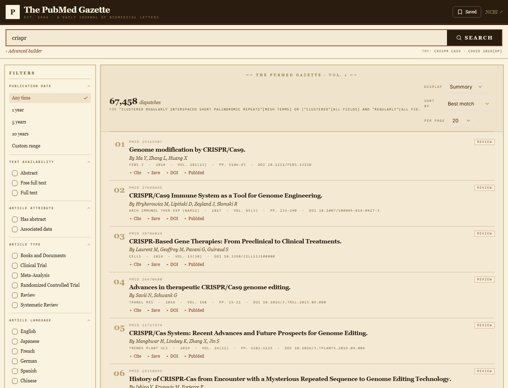

# The PubMed Gazette

A newspaper-styled PubMed search reader.



## What this is for

PubMed already works fine — this app is a thin, polished reading shell on top of it.
Built for people who skim a lot of biomedical citations and want a calmer surface to
do it on. A few specific things it makes nicer than the real site:

- **Less chrome, more content.** Full-width layout, tighter article rows, no banner
  ads or recommendations panel. You scan more results per screen.
- **A coherent reading aesthetic.** Serif typography, parchment palette, small-caps
  metadata — the citation list reads like a journal index instead of a search-results
  page.
- **Shareable URLs.** `?q=`, `?page=`, `?sort=`, `?ps=`, `?display=` all live in the
  URL, so you can bookmark or send a search.
- **Local saves & one-click cite.** Bookmark articles to localStorage (export as JSON
  later); copy citations as AMA / APA / MLA / NLM / BibTeX.
- **Same PubMed search grammar.** Field tags (`[ti]`, `[au]`, `[mesh]`, `[dp]`, …) and
  the boolean Advanced builder work exactly as on PubMed — the Rust backend is a thin
  proxy around NCBI E-utilities (`esearch` / `esummary` / `efetch`).

It is **not** a replacement for PubMed, and it has no account, alerts, or
clipboard/bibliography sync to NCBI. Think of it as a personal reading room.

## Stack

| Layer        | Tech                                                          |
|--------------|---------------------------------------------------------------|
| Frontend     | Vite · React · TypeScript · TailwindCSS · shadcn/ui            |
| Backend      | Rust · Axum · reqwest · quick-xml (proxies NCBI E-utilities)   |
| Dev wiring   | npm workspaces · concurrently · direct CORS (no Vite proxy)    |

## Layout

```
pubmed-search/
├── backend/            Rust + Axum API at http://localhost:8787
│   ├── Cargo.toml
│   └── src/
│       ├── main.rs
│       ├── http/       Handlers + DTOs per resource (search/article/cite/mesh)
│       ├── infra/ncbi/ NCBI client (esearch/esummary/efetch + XML parser)
│       ├── state.rs    AppState — shared deps injected via State<AppState>
│       └── error.rs    AppError + IntoResponse
└── frontend/           Vite dev server at http://localhost:5173 (CORS, no proxy)
    ├── package.json
    └── src/
        ├── App.tsx              Search page
        ├── pages/ArticlePage.tsx Article detail
        ├── components/
        │   ├── Header.tsx
        │   ├── SearchBar.tsx
        │   ├── AdvancedBuilder.tsx
        │   ├── FiltersSidebar.tsx
        │   ├── ResultsToolbar.tsx
        │   ├── ResultItem.tsx
        │   ├── Pagination.tsx
        │   ├── CiteDialog.tsx
        │   ├── SavedDialog.tsx
        │   └── ui/              shadcn primitives
        └── lib/api.ts           Typed client for the backend
```

## Run

One-time install from the repo root (npm workspaces hoists `frontend/` deps):

```powershell
cd E:\workspace\PoC\pubmed-search
npm install
```

### Both at once (recommended)

```powershell
npm run dev    # cargo run + vite dev, color-prefixed via concurrently
```

Stop with `Ctrl-C` once — concurrently shuts down both.

### Individually

```powershell
npm run dev:backend   # http://localhost:8787  (cargo run)
npm run dev:frontend  # http://localhost:5173  (Vite; calls backend directly via CORS)
```

### Optional NCBI credentials (10 req/s instead of 3)

```powershell
$env:NCBI_API_KEY = "your_key_here"
$env:NCBI_EMAIL   = "you@example.com"
npm run dev
```

### Production-ish

```powershell
npm run build   # cargo build --release + vite build
npm run start   # cargo run --release + vite preview
```

## Features

| Area              | Notes                                                                  |
|-------------------|------------------------------------------------------------------------|
| Top search bar    | Single input + Search; matches PubMed entry point                      |
| Advanced builder  | Boolean rows (AND/OR/NOT) + field tags ([ti], [au], [mesh], [dp]…)     |
| Filter sidebar    | Publication date, Text availability, Article attribute, Article type,  |
|                   | Language, Species, Sex, Age, Other — same order as PubMed              |
| Results list      | Numbered article rows, citation metadata, PMID/PubType chips           |
| Sort, display     | Best match / recent / first author / journal / title · Summary / PMID  |
| Article detail    | Abstract (structured), authors, affiliations, MeSH, keywords           |
| Cite              | AMA / APA / MLA / NLM / BibTeX with one-click copy                     |
| Save              | LocalStorage-backed, JSON export                                       |
| URL state         | `?q=…&page=…&sort=…&ps=…&display=…` — shareable searches               |

## Notes

- NCBI rate limits: 3 req/s anonymous, 10 req/s with API key. The backend sends
  `tool` / `email` per NCBI guidelines.
- The Rust backend is intentionally a thin proxy — no DB, no auth. Add Redis/PG
  later if you want cached searches or accounts.
- No Vite dev proxy: the frontend calls the Rust backend directly. CORS is enabled
  on the backend, and `VITE_API_URL` lets you override the default `http://127.0.0.1:8787`.
