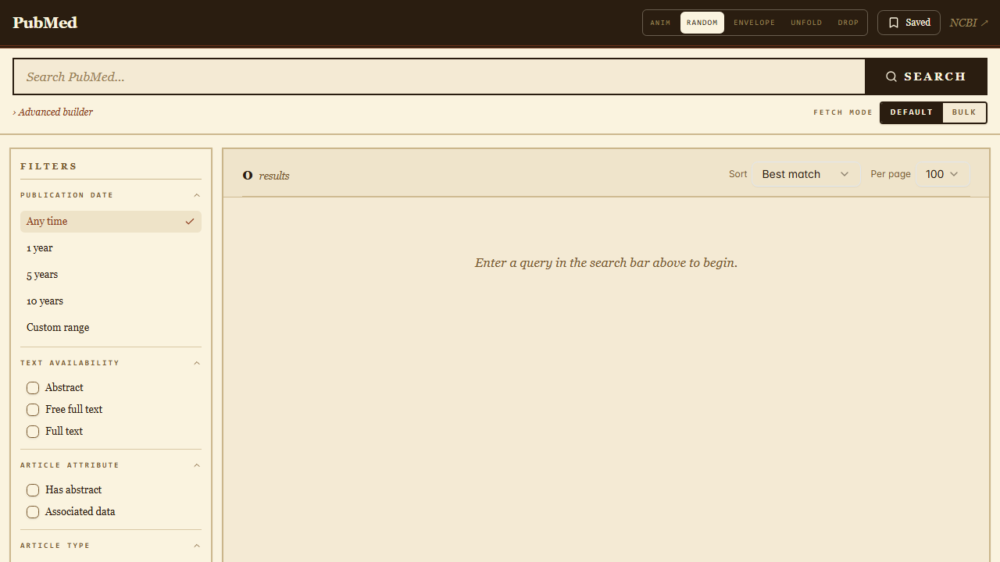
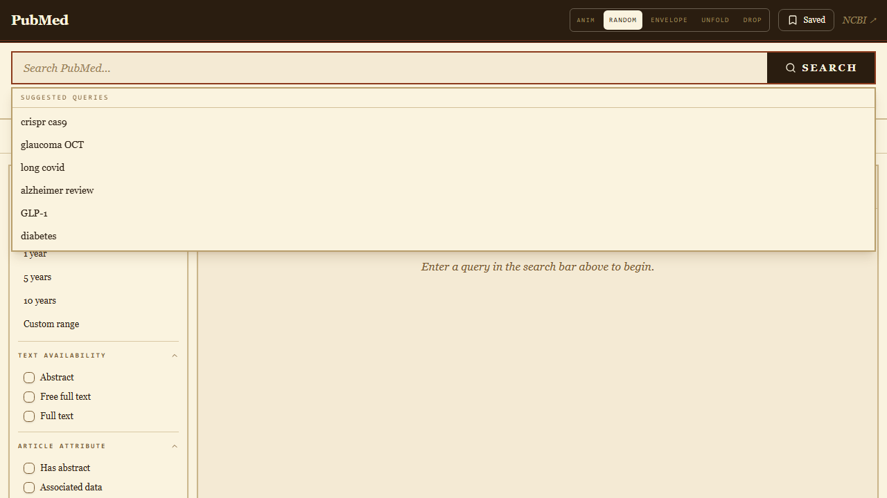
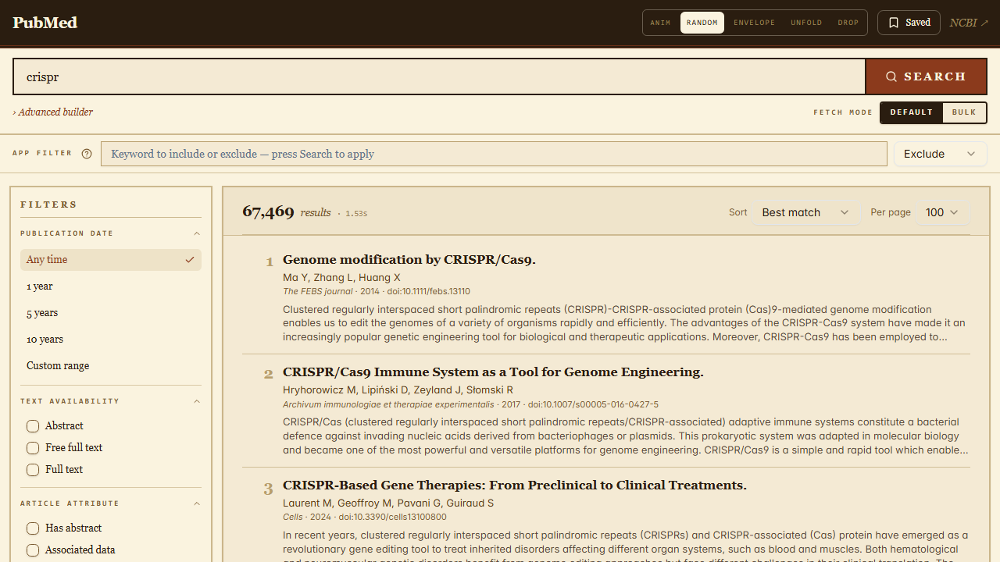
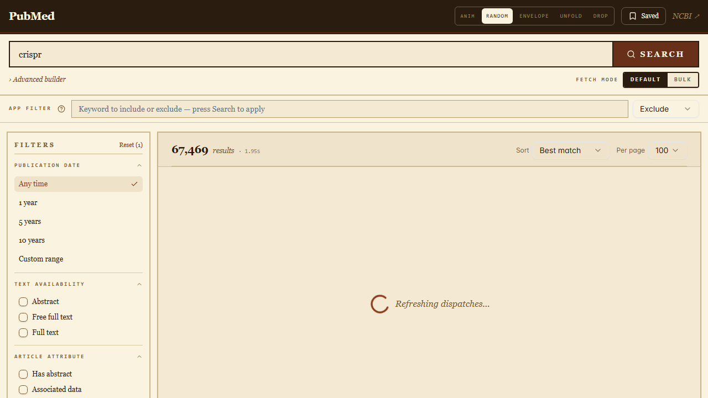
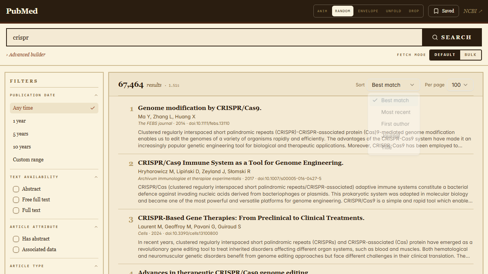
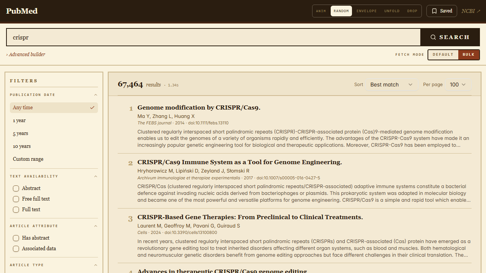
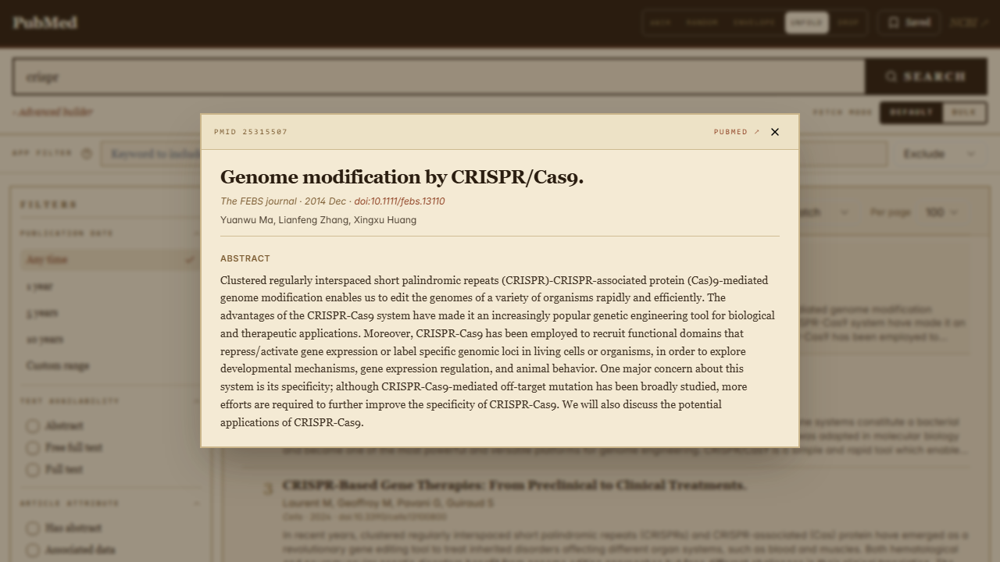
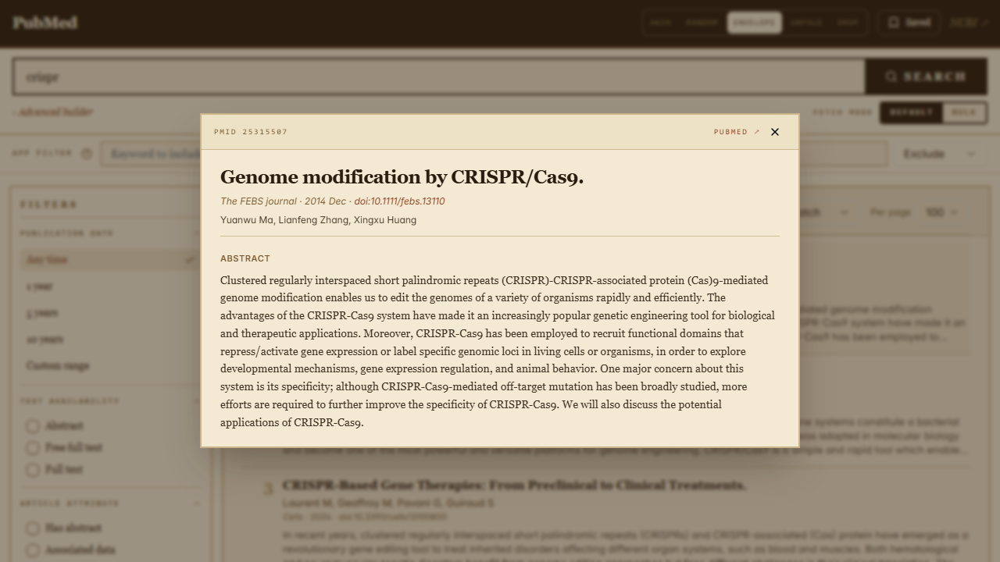
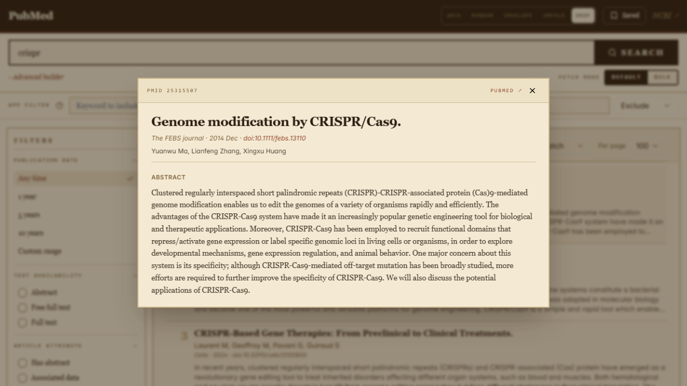

# PubMed Search — User Manual

A static-feeling newsletter / paper-print themed UI in front of NCBI's
PubMed API. This document walks through every visible piece of the
application; every screenshot below is reproducible from the e2e
suite (`npm run e2e` in `frontend/`).

---

## 1. Overview

When you load the app you get four regions on one page:

1. **Header** — branding, the `ANIM` switcher (article-open animation
   selector), the **Saved** drawer trigger, an external link to NCBI.
2. **Search bar** — query input, the `Advanced builder` link, and the
   **FETCH MODE** toggle (`Default` / `Bulk`).
3. **Filters sidebar** — date, text availability, article type,
   language, species, sex, age, and other PubMed flag-filters.
4. **Results region** — initially empty; after a search it shows a
   toolbar (result count, sort, per-page) plus the result list and
   pagination.



---

## 2. Searching

### 2.1 Suggested-query hints

Focusing the search input opens a small **Suggested queries** dropdown
with example terms (`crispr cas9`, `glaucoma OCT`, `long covid`, etc.).
Clicking one fills the input — it does **not** submit; you still need
to press **Search** or hit `Enter`.



### 2.2 Submitting a search

Type a query and press **Search** (or `Enter`). The button is the *only*
trigger — changing filters / sort / per-page / fetch-mode does **not**
auto-fetch. This matches PubMed's own apply-then-search UX so heavy
queries don't fire mid-edit.

After the round-trip you get:

- A bold result count and the round-trip time (e.g. `67,464 results · 2.58s`)
- 100 result rows by default (configurable per-page: 100 / 500 / 1,000 / 5,000 / 10,000)
- Pagination at the bottom of the results panel



---

## 3. Filtering and sorting

### 3.1 Filters sidebar

Check any combination of filters. The selections do **not** apply
immediately — they're staged. Pressing **Search** commits them all at
once. Use the **Reset (N)** link at the top of the sidebar to clear.

Filters available:

- **Publication date** — Any time / 1, 5, 10 years / custom range
- **Text availability** — Abstract, Free full text, Full text
- **Article attribute** — Has abstract, Associated data
- **Article type** — Books, Clinical Trial, Meta-Analysis, RCT, Review, Systematic Review
- **Language** — English, Japanese, French, German, Spanish, Chinese
- **Species** — Humans / Other animals
- **Sex** — Female / Male
- **Age** — Infant / Child / Adolescent / Adult / Aged
- **Other** — Exclude animal studies, MEDLINE, PubMed Central



### 3.2 Sort & per-page

The results toolbar exposes two dropdowns:

- **Sort** — Best match (default), Most recent, Pub. date, First author, Journal
- **Per page** — 100 / 500 / 1,000 / 5,000 / 10,000

Like filters, these are staged and only take effect after the next **Search** press.



---

## 4. Fetch mode — `Default` vs `Bulk`

Underneath the search bar there's a **FETCH MODE** segmented toggle.
The two modes use two different NCBI access patterns to retrieve the
same records:

| Mode      | NCBI call                                     | What it gives the client                          |
|-----------|-----------------------------------------------|---------------------------------------------------|
| `Default` | `esearch` + `efetch` with PMIDs in POST body  | Lightweight, one round-trip                       |
| `Bulk`    | `esearch?usehistory=y` + `efetch_bulk(WebEnv)`| Heavier per call; warms the server-side article cache so subsequent article clicks are ~0 ms |

The toggle is intentionally kept distinct — the two paths are *not*
equivalent, even when wall times happen to match for a given run. The
benchmark suite under `backend/tests/benchmark.rs` is the source of
truth for comparing them.



---

## 5. Reading an article

Clicking any result row opens an **article modal** centered over the
page. The modal contains:

- A header strip with the PMID, an external `PubMed ↗` link, and a
  close button
- Title (HTML-safe rendering, supports italics/sub/sup as PubMed sends)
- Journal · publication date · DOI
- Author list
- **Abstract** (split into paragraphs)
- **References** (when present) with PMID / DOI links

Press `Esc` or click the dim backdrop outside the panel to close.



---

## 6. Animation variants

The article modal opens with a two-phase newsletter-arrival animation:

- **Phase 1** — a paper/mail icon flies in from off-screen toward
  centre.
- **Phase 2** — the modal panel materialises and the content reveals
  per the variant's choreography.

The **ANIM** segment in the header lets you pick which choreography
plays. **Random** (default) rolls one of the three per click.

### 6.1 Envelope — bird-delivery + letter-opener

A carrier bird (flapping wings) glides in from the upper-right with a
sealed wax-stamped envelope. After arrival the bird peels off to the
upper-left while the envelope settles. A letter-opener then sweeps
across the panel, the wax seal jolts from the cut, and the flap
rotates open to reveal the article.



### 6.2 Unfold — folded newsletter

A folded newsletter glides in from the lower-left. After the panel
appears, the three sections (header / abstract / references) fan open
one after another, each hinging from its top edge — the way you'd
unfold a printed bulletin.


### 6.3 Drop — rolled letter

A rolled letter with a red ribbon drops from above the viewport. The
panel pops in with a tilt and bounce, then each section has a small
extra "settle" tilt as if the paper just landed on a desk.



---

## 7. Keyboard shortcuts

| Key                  | Action                                  |
|----------------------|------------------------------------------|
| `Enter` (in search)  | Submit search                           |
| `Esc` (modal open)   | Close article modal                     |
| `Tab` / `Shift+Tab`  | Move focus through controls             |
| `Enter` / `Space`    | Activate the focused result row / button|

The search input is focused automatically on page load via a `useRef +
useEffect` pattern (no `autoFocus` attribute — that one is discouraged
by `jsx-a11y` because screen readers can't anticipate it).

---

## 8. URLs and deep links

State is encoded in the query string so any view is shareable:

- `/?q=crispr` — search for "crispr"
- `/?q=crispr&page=3` — page 3 of those results
- `/?q=crispr&ps=500` — 500 rows per page
- `/?q=crispr&sort=date` — sorted by publication date
- `/?q=crispr&bulk=1` — bulk fetch mode
- `/?q=crispr&filters=Review[pt],English[lang]` — apply two filters
- `/article/<pmid>` — direct article page (standalone route, kept for
  shareable links; the in-page modal is the primary surface)

---

## 9. Reproducing the screenshots

Each screenshot in this manual is the output of a Playwright spec
under [`frontend/e2e/`](../frontend/e2e/). To regenerate them:

```powershell
cd frontend

# One-time install
npm install --save-dev @playwright/test
npx playwright install chromium

# Pre-requisite: dev servers running on :5173 (Vite) and :8787 (backend).
npm run e2e
```

Outputs are written to `docs/screenshots/*.png` (committed) and
`frontend/playwright-report/` (gitignored — open with `npm run
e2e:report`).
