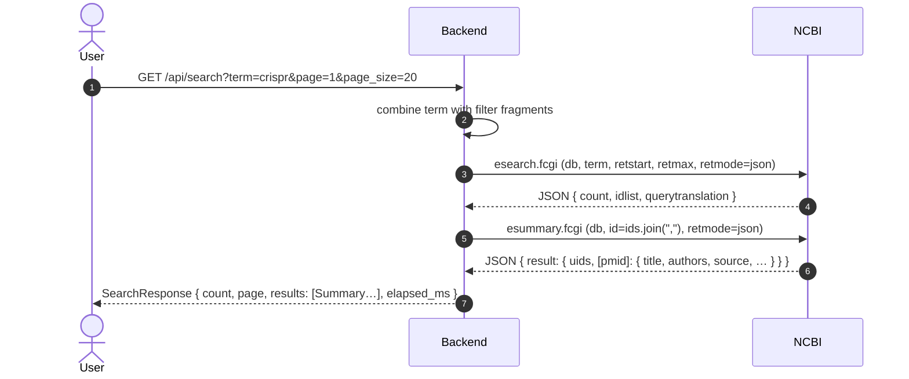
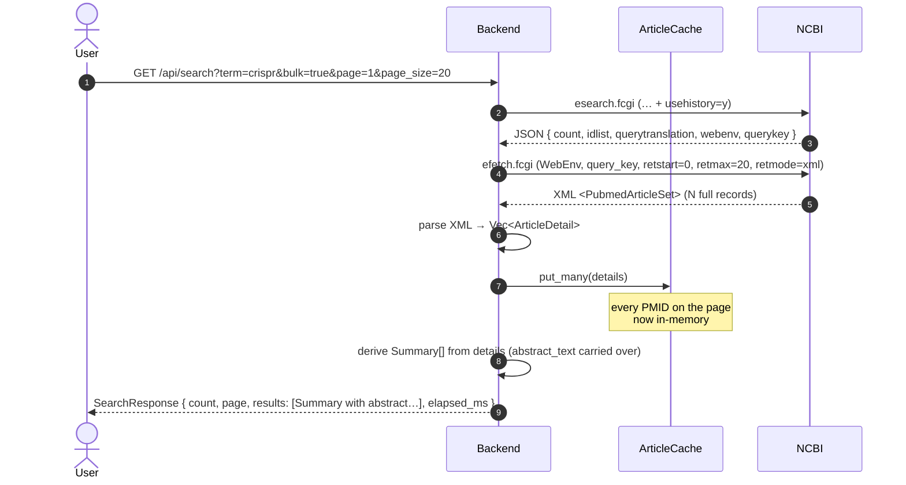

# Data flow: default search vs bulk search

Two end-to-end traces of **what happens when the user runs a search**.
Same UI, same data shape on disk — the only difference is the
`FETCH MODE` toggle (`Default` / `Bulk`) under the search input.

---

## 1. Default search (`bulk=false`)

Two upstream NCBI hops. The cheap, lightweight path. Result rows do
**not** carry abstracts.

**Key points:**
* Two NCBI calls per search.
* esummary returns metadata only — no abstracts.
* No article cache touched.

---

## 2. Bulk search (`bulk=true`)

Two upstream NCBI hops too — but the second one uses NCBI's history
server (`WebEnv`/`QueryKey`) to pull **full article records in one
shot** instead of just metadata. Heavier per call but every PMID on
the page lands in the backend cache.

**Key points:**
* Same two NCBI hops as default, but the second is heavier (XML, full
  records).
* All page PMIDs land in the article cache → any later
  `/api/article/{pmid}` for one of them is served from memory.
* Summary rows carry `abstract_text` for inline snippets.

---

## 3. Default vs Bulk at a glance

|                           | Default                  | Bulk                                  |
|---------------------------|--------------------------|---------------------------------------|
| NCBI calls per search     | 2 (esearch + esummary)   | 2 (esearch + efetch_bulk)             |
| Wire format of 2nd call   | JSON, light              | XML, heavy                            |
| Page payload size         | small                    | ~10×                                  |
| Initial search latency    | ~1.0 s                   | ~1.5–2.0 s                            |
| Abstract in result rows   | no                       | yes                                   |
| Article cache warmed      | no                       | every PMID on the page                |
| Same data per PMID        | guaranteed by parity tests                                       ||
