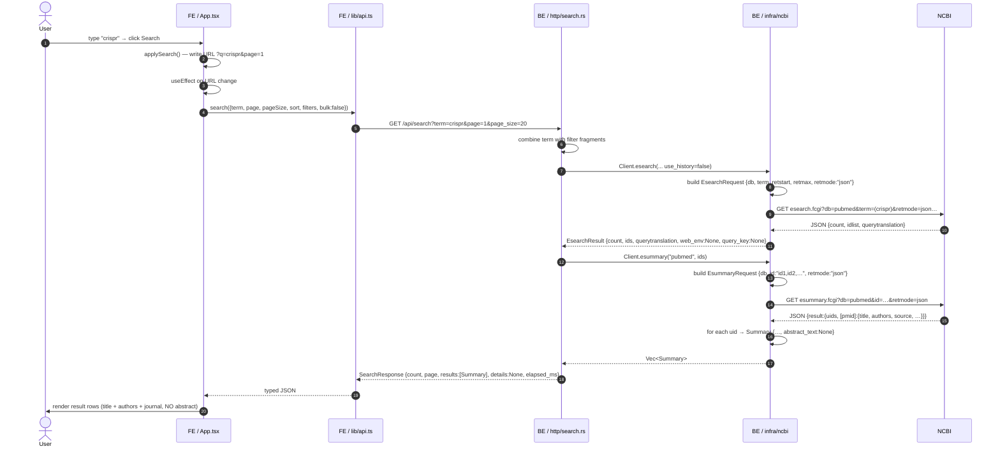
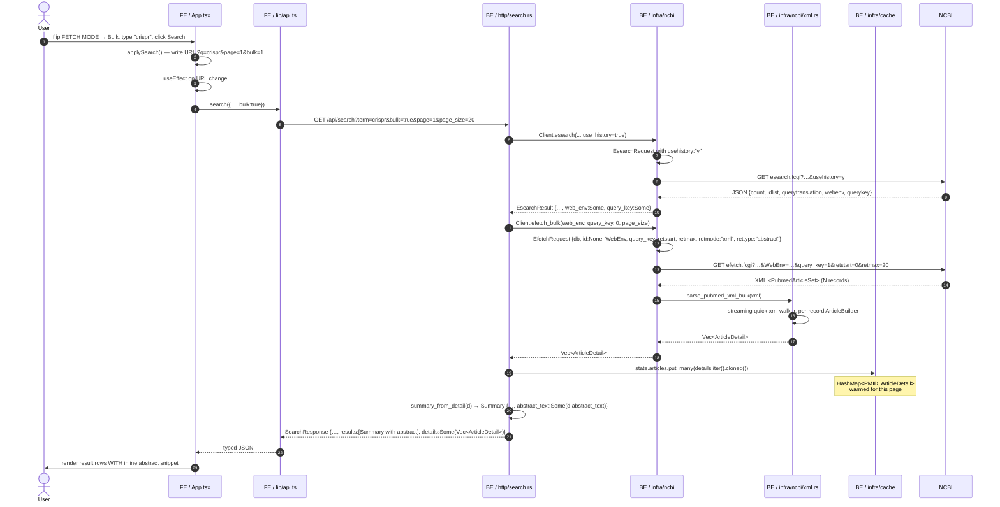

# Data flow: default search vs bulk search

Two end-to-end traces of **what happens when the user runs a search**.
Same UI, same DTOs — the only difference is the `FETCH MODE` toggle
(`Default` / `Bulk`) under the search input.

Layer prefixes used throughout:
* **FE** — React frontend (`frontend/src/…`)
* **BE** — Rust backend (`backend/src/…`)
* **NCBI** — public NCBI E-utilities

---

## 1. Default search (`bulk=false`)

Two upstream NCBI hops. The cheap, lightweight path. Result rows do
**not** carry abstracts.

**Key points:**
* Two NCBI calls per search.
* esummary returns metadata only; `abstract_text` on every `Summary`
  is `None`.
* `SearchResponse.details` is omitted from the wire (skip_serializing_if).
* Process-local article cache (`state.articles`) is **not touched**.

---

## 2. Bulk search (`bulk=true`)

Two upstream NCBI hops too — but the second one uses NCBI's history
server (`WebEnv`/`QueryKey`) to pull **full article records in one
shot** instead of just metadata. The result is heavier per call but
every PMID on this page lands in the backend cache.

**Key points:**
* Same number of NCBI hops as Default (2), but the second one is
  heavier — `efetch` returns full XML for all PMIDs on the page.
* `parse_pubmed_xml_bulk` walks `<PubmedArticleSet>` and yields one
  `ArticleDetail` per `<PubmedArticle>` using a per-record
  `ArticleBuilder` to scope state.
* **`state.articles.put_many(...)` is where the speedup lands** — it
  warms the process-local cache so any later `/api/article/{pmid}`
  for these PMIDs is served from memory.
* `summary_from_detail` carries `abstract_text` over from the
  `ArticleDetail` so the frontend can render inline snippets.

---

## 3. Default vs Bulk at a glance

|                           | Default                       | Bulk                                  |
|---------------------------|-------------------------------|---------------------------------------|
| NCBI calls per search     | 2 (esearch + esummary)        | 2 (esearch + efetch_bulk)             |
| Wire format of 2nd call   | JSON, light                   | XML, heavy                            |
| Page payload size         | small                         | ~10×                                  |
| Initial search latency    | ~1.0 s                        | ~1.5–2.0 s                            |
| Abstract in result rows   | no                            | yes (`Summary.abstract_text`)         |
| `state.articles` warmed   | no                            | yes — every PMID on the page          |
| `details` field returned  | `None` (omitted from JSON)    | `Some(Vec<ArticleDetail>)`            |
| Same data per PMID        | guaranteed (see `tests/parity.rs`)                              ||
